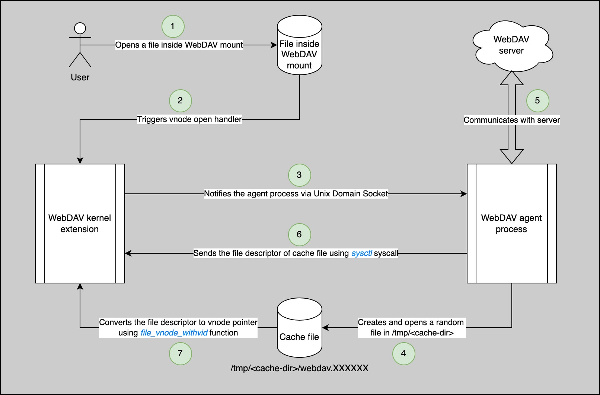

#  Portal - LPE vulnerability in macOS WebDAV kernel extension

WebDAV (Web-based Distributed Authoring and Versioning) protocol allows users to collaboratively edit and manage files 
on remote web servers [[ref]](http://www.webdav.org). This functionality for opening WebDAV network shares in macOS is 
mainly provided by WebDAV kernel extension (webdav_fs.kext) 
[[ref]](https://opensource.apple.com/source/webdavfs/webdavfs-380.200.1/). 

